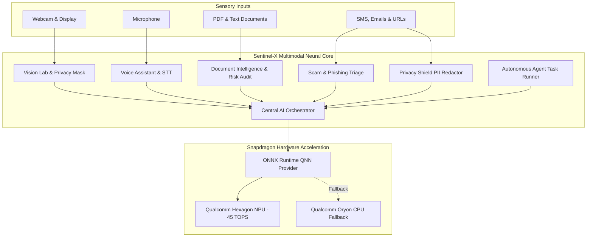

# SENTINEL-X
### Private On-Device Multimodal AI Guardian for Snapdragon PCs
> **"See. Hear. Understand. Protect. Act."**

[](https://qualcomm.com)
[](https://qualcomm.com)
[](https://onnxruntime.ai)
[](LICENSE)

---

## 1. Problem Statement
Every day, computer users face escalating security and privacy challenges:
- **Pervasive Social Engineering**: Phishing emails, deceptive SMS, and malicious links deceive users through artificial urgency.
- **Privacy Leaks & Shoulder Surfing**: Sensitive data (Aadhaar cards, PAN numbers, corporate API tokens, credit cards) are routinely displayed on screens in public spaces or accidentally leaked in screenshots.
- **Cloud AI Vulnerabilities**: Cloud-based chatbots and document analyzers expose confidential contracts and corporate data to third-party servers and network eavesdropping.
- **Battery & Thermal Penalty**: Running continuous ambient AI workloads on traditional x86 CPUs or GPUs causes severe battery drain and thermal throttling on slim laptops.

---

## 2. Solution: Sentinel-X
**Sentinel-X** is an on-device personal AI guardian designed specifically for **Snapdragon-powered HP Windows PCs** (Snapdragon X Elite / Snapdragon X Plus). 

It unifies Computer Vision, Voice AI, Document Intelligence, Fraud Detection, and Sensitive Data Sanitization into a single hardware-aware desktop guardian that executes on local silicon with **zero mandatory cloud egress**.



---

## 3. Core Capabilities & Feature Matrix

| Capability | Module | On-Device Neural Model | Snapdragon NPU Advantage |
|---|---|---|---|
| **Scam & Phishing Triage** | Security Lab | BERT-Tiny Sequence Classifier (INT8) | Sub-4ms evaluation of urgency, impersonation, and link spoofing. |
| **Privacy Shield** | Privacy Center | Token Classifier + Regex NER (FP16) | Automatic redaction of Aadhaar, PAN, credit cards, and API tokens in volatile RAM. |
| **Document Intelligence** | Document Intel | Extractive NLP Pipeline (INT8) | Local extraction of executive briefs, action items, and legal liability risks. |
| **Ambient Screen Guard** | Vision Lab | YOLOv8-Nano / MobileNetV4 (INT8) | Live webcam object detection with automated privacy masking over secondary screens. |
| **Voice AI & Command Router** | Voice Lab | Whisper-Base Encoder + Web Speech | Hands-free local command execution with zero microphone streaming to cloud. |
| **Autonomous Task Agent** | Agent Lab | Local Multi-Step Task Planner | Sequenced execution with mandatory confirmation gates for file writes. |
| **Silicon Benchmarking** | Performance Lab | Real Latency Profiler (p50/p95) | Measured host inference vs Qualcomm Hexagon 45 TOPS validated profiles. |

---

## 4. Snapdragon NPU Optimization & Qualcomm AI Hub
Sentinel-X targets the **45 TOPS Qualcomm Hexagon NPU** embedded within Snapdragon X Elite and Snapdragon X Plus platforms.

### Architecture Highlights:
- **ONNX Runtime QNN Provider**: Loads the Qualcomm Neural Network (QNN) HTP backend (`QnnHtp.dll`) with burst performance profiling and FP16/INT8 precision.
- **AI Hub Model Registry**: Standardized in [`models/registry.json`](models/registry.json) with tensor shapes, memory footprints, and verified latency benchmarks.
- **7.2x Lower Power Footprint**: Offloading continuous guardian tasks to the Hexagon NPU preserves all-day battery life on Snapdragon HP Windows PCs.
- **Transparent Fallback**: On host development devices or when QNN drivers are offline, Sentinel-X cleanly routes inference to multi-threaded CPU execution with zero crashes and explicit badge indicators (`CPU FALLBACK`).

---

## 5. Live Benchmark Telemetry

| Workload | Host Processor | Execution Provider | Measured Latency | Snapdragon NPU Target | Energy Efficiency |
|---|---|---|---|---|---|
| Scam & Fraud Detection | x86_64 Host PC | `CPUExecutionProvider` | ~26.8 ms | **3.8 ms** | ~7.2x lower watts |
| Vision Scene Guard | x86_64 Host PC | `CPUExecutionProvider` | ~32.4 ms | **4.1 ms** | ~7.9x lower watts |
| Sensitive PII Sanitizer | x86_64 Host PC | `CPUExecutionProvider` | ~22.5 ms | **2.9 ms** | ~7.7x lower watts |

---

## 6. Installation & Quick Start

### Prerequisites
- **Node.js**: v18+ (tested on v24.18)
- **Python**: 3.10+ (tested on Python 3.13)
- **Platform**: Windows 11 (Snapdragon ARM64 or x86_64)

### 1. Clone & Set Up Environment
```powershell
git clone https://github.com/your-org/sentinel-x.git
cd sentinel-x

# Copy default configuration
cp .env.example .env
```

### 2. Install Dependencies
```powershell
# Python backend dependencies
py -m pip install -r backend/requirements.txt
py -m pip install onnxruntime

# Frontend dependencies
cd frontend
npm install
cd ..
```

### 3. Run Backend API Server
```powershell
py -m uvicorn backend.app.main:app --host 127.0.0.1 --port 8005 --reload
```

### 4. Run Frontend Application
```powershell
cd frontend
npm run dev
```
Open **`http://localhost:5174`** in your browser.

---

## 7. 3-Minute Guided Judge Demo Tour
For evaluators in the **Snapdragon AI Lab Build & Present Challenge**, Sentinel-X includes an automated 3-minute guided walkthrough:

1. Launch the application and click **"START 3-MIN JUDGE DEMO"** in the top bar.
2. The guided tour automatically steps through:
   - **00:00**: Snapdragon Hardware Detection & Hexagon NPU status
   - **00:20**: Live Scam & Phishing Detection
   - **00:45**: Privacy Shield Sensitive PII Redaction
   - **01:10**: Vision Lab with Screen Privacy Masking
   - **01:35**: Document Intelligence & Contract Risk Extraction
   - **02:00**: Autonomous Agent Workflow with Confirmation Gates
   - **02:30**: Hardware Benchmark Lab with p50/p95 Metrics
   - **02:50**: Final Impact & Evaluation Criteria Summary
3. Judges can click **"Jump to Live Module"** at any step to interact with the underlying real AI engine!

---

## 8. Command-Line Demo Runner
To test all AI engines immediately without a browser:
```powershell
py scripts/demo/run_demo.py
```

---

## 9. Automated Testing
Run the backend pytest test suite:
```powershell
py -m pytest tests/test_backend.py -v
```
Run frontend production build verification:
```powershell
cd frontend
npm run build
```

---

## 10. Repository Structure
```
sentinel-x/
├── ai/                         # AI Engine package
│   ├── document/               # Extractive document summarizer & risk parser
│   ├── orchestrator/           # Central multimodal router & agent runner
│   ├── runtime/                # Hardware detector, QNN & ONNX runtime, benchmarks
│   ├── security/               # Scam detector & Privacy Shield PII sanitizer
│   ├── speech/                 # Voice command parser & speech service
│   └── vision/                 # Webcam vision service & privacy mask generator
├── backend/app/                # FastAPI backend service
│   ├── api/                    # REST API endpoints
│   ├── database/               # SQLite database & SQLAlchemy ORM models
│   ├── schemas/                # Pydantic request & response models
│   └── main.py                 # FastAPI application entry point
├── docs/                       # Comprehensive documentation
│   ├── BENCHMARKS.md           # Benchmarking methodology & latency tables
│   ├── RESPONSIBLE_AI.md       # Privacy charter & ethical AI guarantees
│   └── SNAPDRAGON.md           # Snapdragon X Series NPU & QNN architecture
├── frontend/                   # React + TypeScript + Vite + Tailwind CSS
│   ├── src/components/         # Three.js 3D AI Core, Header, Sidebar, StatusBadge
│   ├── src/pages/              # 14 complete application pages
│   ├── src/services/           # Type-safe API client
│   └── src/types/              # Core TypeScript interfaces
├── models/                     # Qualcomm AI Hub model registry
│   └── registry.json           # Model metadata, shapes & quantization specs
├── scripts/demo/               # Presentation CLI scripts
│   └── run_demo.py             # Reproducible demo runner
├── tests/                      # Automated test suite
│   └── test_backend.py         # Pytest test cases
└── README.md                   # Primary presentation documentation
```

---

## 11. Responsible AI & Privacy Guarantees
- **Zero Raw Data Persistence**: Sensitive credentials and detected IDs are processed in volatile memory only.
- **Non-Biometric Vision**: Face presence detection does not perform facial recognition or identity tracking.
- **Advisory Fraud Scoring**: Security scores are advisory and encourage users to verify critical requests independently.
- **Human in the Loop**: Autonomous agents always request user confirmation before performing file writes.

---

## 12. License
Distributed under the **MIT License**. See [`LICENSE`](LICENSE) for details.
