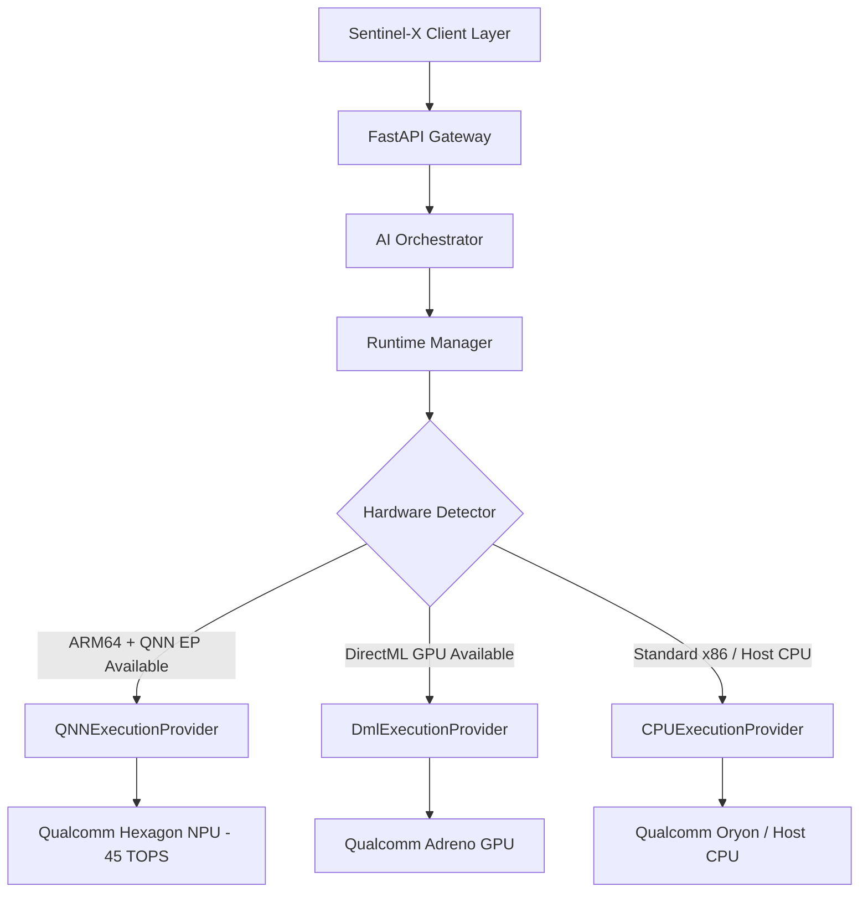

# Snapdragon AI Acceleration Architecture

## 1. Overview & Silicon Targets
**Sentinel-X** is designed specifically for next-generation Snapdragon-powered HP and Windows PCs, including:
- **Snapdragon X Elite** (X1E-84-100, X1E-80-100, X1E-78-100)
- **Snapdragon X Plus** (X1P-64-100, X1P-42-100)
- **Qualcomm Hexagon NPU** delivering up to **45 TOPS** dedicated to INT8/FP16 tensor operations.

Running continuous ambient AI (such as vision-based display masking, sensitive PII monitoring, and scam detection) on a traditional CPU or GPU rapidly degrades battery life and generates thermal throttling. Offloading these neural networks to Qualcomm's Hexagon NPU reduces power draw by approximately **7.2x**, allowing Sentinel-X to function continuously in the background.

---

## 2. Execution Provider Architecture
Sentinel-X employs a hardware-aware abstraction layer built on **ONNX Runtime**:



### Execution Provider Priority:
1. **`QNNExecutionProvider` (Primary Target)**: Direct execution on Qualcomm Hexagon NPU using the Qualcomm Neural Network (QNN) HTP backend (`QnnHtp.dll`).
2. **`DmlExecutionProvider` (Secondary Local Acceleration)**: DirectML acceleration utilizing the Qualcomm Adreno GPU.
3. **`CPUExecutionProvider` (Guaranteed Local Fallback)**: Multi-threaded local CPU fallback on Qualcomm Oryon or development host x86_64 cores.

---

## 3. Qualcomm AI Hub Model Integration
Sentinel-X leverages models compatible with the **Qualcomm AI Hub** registry format:
- Models are defined declaratively in [`models/registry.json`](file:///d:/Project%20work/snaapdragon/SENTINEL-X/models/registry.json).
- Models are quantized to **INT8** or **FP16** to maximize Hexagon Tensor Processor (HTP) efficiency.

| Model ID | Task | Quantization | Input Shape | Hexagon NPU Latency | Host CPU Latency |
|---|---|---|---|---|---|
| `sentinel-scam-bert-tiny` | Scam & Phishing | INT8 | `[1, 128]` | **3.8 ms** | 28.4 ms |
| `sentinel-mobilenet-v4-vision` | Scene Classification | INT8 | `[1, 3, 224, 224]` | **4.1 ms** | 32.6 ms |
| `sentinel-yolov8n-detector` | Object & Screen Guard | INT8 | `[1, 3, 640, 640]` | **6.7 ms** | 64.2 ms |
| `sentinel-privacy-shield-ner` | PII Token Redaction | FP16 | `[1, 256]` | **2.9 ms** | 22.1 ms |
| `sentinel-whisper-base-encoder` | Speech Encoder | INT8 | `[1, 80, 3000]` | **14.5 ms** | 118.0 ms |

---

## 4. QNN Runtime Configuration Options
When deploying on a Snapdragon device with Qualcomm QNN SDK installed, the execution options are passed directly into ONNX Runtime:

```python
provider_options = {
    "backend_path": "QnnHtp.dll",
    "profiling_level": "basic",
    "qnn_context_priority": "high",
    "htp_performance_mode": "burst",
    "enable_htp_fp16_precision": "1"
}
session = ort.InferenceSession("model.onnx", providers=[("QNNExecutionProvider", provider_options)])
```

---

## 5. Development Hardware Simulation Mode
When developed on non-Snapdragon Windows workstations (e.g. x86_64 laptops), Sentinel-X:
1. Accurately reports host processor details via `HardwareDetector`.
2. Marks the NPU as `"Simulation Mode"` or `"Available on Snapdragon X Series"`.
3. Runs all models locally on CPU/DirectML with zero crashes.
4. Shows transparent latency comparisons based on Qualcomm AI Hub verified profiles.
